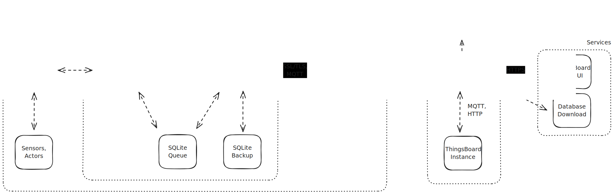

# ACROPOLIS CO2 Sensor Network

This repository contains the software and hardware blueprints for the measurement systems deployed at the edge of the **ACROPOLIS** (Autonomous and Calibrated Roof-top Observatory for MetroPOLItan Sensing) CO2 sensor network. This initial network consists of twenty prototype systems evenly distributed across the city of Munich. The project is part of [**ICOS Cities**](https://www.icos-cp.eu/projects/icos-cities), funded by the European Union's Horizon 2020 Research and Innovation Programme under grant agreement No. **101037319**.

 

## Key Features

- **Non-Expert Setup**: The software is designed for easy deployment, requiring minimal technical expertise for setup and operation.
- **Scalability**: The network infrastructure allows for seamless scaling, enabling easy expansion to a larger number of devices and locations.
- **Remote Software and Configuration Update**: Supports remote updates for software and configuration, ensuring continuous improvement and easy deployment of changes.
- **Dockerized Edge Software**: The edge software runs within a Docker container for isolated and consistent deployment.
- **Edge Agent**: A standalone process managing the Dockerized edge software, controlling the active container version and acting as the endpoint for remote commands. It implements a MQTT client to act as a communication gateway.
- **ThingsBoard Integration**: All measurements are transmitted via MQTT to a hosted ThingsBoard instance for centralized data collection and analysis.
- **Offline Data Backup**: SQLite implementation serves as a local backup for measurement data.

 

## Repository Overview

- Software
- Hardware
- Setup

## System Overview

Each edge system is managed by a Raspberry Pi 4, utilizing an LTE hat (NB-IoT) for internet connectivity. The primary sensor is the Vaisala GMP343 CO2 sensor, accompanied by auxiliary BME280 and SHT45 sensors for environmental monitoring. Airflow is regulated by a brushless membrane pump and 2/2 valves, which switch between the sampling head and calibration tanks. Additionally, a Vaisala WXT-532 wind sensor is co-located with the sampling head to monitor wind conditions. The system includes a UPS and battery backup to ensure uninterrupted operation.

 

## Software Architecture

First Draft

 
