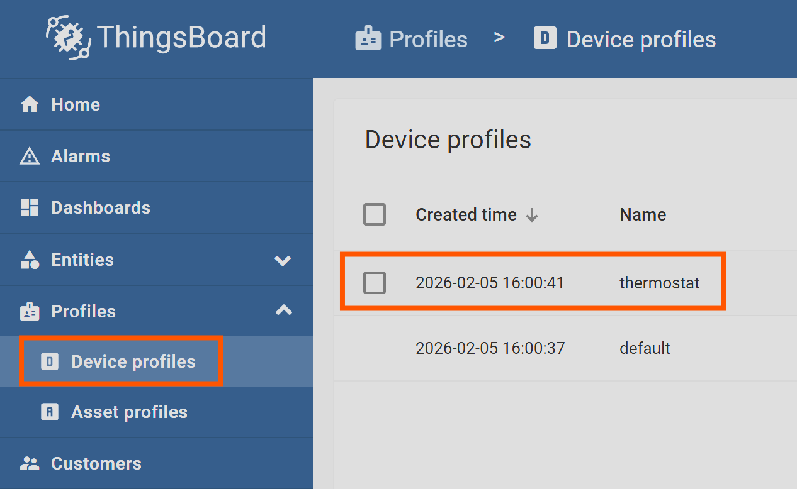
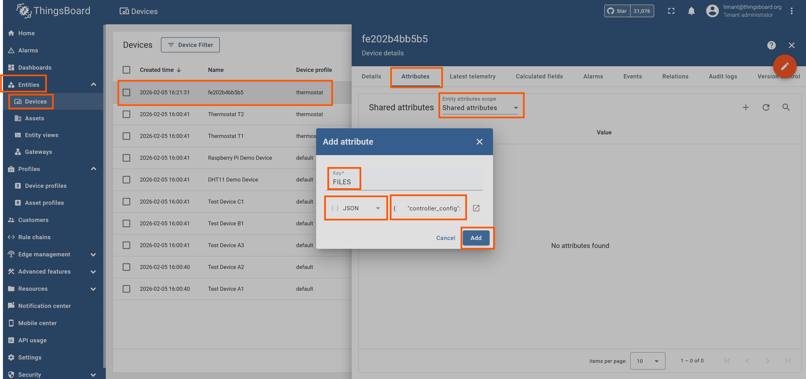

Demo
====

This docker-based demo deployment runs a local ThingsBoard instance together with the edge gateway and a simulated controller.
It is meant for showcasing the thingsboard-edge-gateway's features in an easy to set up example environment.

What the demo includes
----------------------
- ThingsBoard CE + Postgres
- Edge gateway container built from this repository
- Example controller that generates simulated sensor data
- Optional TLS reverse proxy (nginx) with a self-signed certificate
- Example thingsboard dashboard for visualizing the simulated sensor data

Requirements
------------
- Docker
- Docker Compose
- Optional: openssl (only if you want to regenerate the self-signed cert)

Install Docker
--------------

Windows/macOS
~~~~~~~~~~~~~
`Docker Desktop <https://docs.docker.com/get-docker/>`_ (includes Docker Compose).

Linux
~~~~~
Docker Engine and the Compose plugin from `https://docs.docker.com/engine/install/ <https://docs.docker.com/engine/install/>`_
and `https://docs.docker.com/compose/install/linux/ <https://docs.docker.com/compose/install/linux/>`_.

.. code-block:: bash

    sudo apt update
    sudo apt install docker.io docker-compose-v2

Optional TLS tooling
~~~~~~~~~~~~~~~~~~~~

.. code-block:: bash

    sudo apt install openssl

Verify requirements
-------------------
Verify that the CLIs are available:

.. code-block:: bash

    docker --version
    docker compose version

Optional:

.. code-block:: bash

    openssl version

.. _prepare-the-demo-data-directory:

Prepare the demo data directory
-------------------------------
Create a local data folder and point the demo to it:

.. code-block:: bash

    cd demo
    mkdir -p data/edge-gateway
    echo "TEG_DATA_PATH=$(realpath data/edge-gateway)" >> .env

Run the full demo (local ThingsBoard)
-------------------------------------
Initialize ThingsBoard on first run:

.. code-block:: bash

    docker compose -f docker-compose-thingsboard.yml run --rm \
        -e INSTALL_TB=true -e LOAD_DEMO=true thingsboard

Output should look similar to:

.. code-block:: text

    Starting ThingsBoard Installation...
    Installing database schema for entities...
    ...
    Loading system images and resources...
    Loading demo data...
    Installation finished successfully!

To run the demo once it has been initialized:

.. code-block:: bash

    docker compose -f docker-compose-thingsboard.yml up

Open ThingsBoard at `http://localhost:8080/ <http://localhost:8080/>`_ and sign in with:

- user: `tenant@thingsboard.org`
- password: `tenant`

Enable device self-provisioning
-------------------------------
Assign the self-provisioning credentials to the "thermostat" device profile:

1. Open the device profile "thermostat"
2. Device provisioning -> Edit

3. Provision strategy: "Allow to create new devices"
4. Provision device key: `cl4ozm17lhwpafnz8jau`
5. Provision device secret: `7jemz65a0498pb5wzuk8`
6. Save the profile ("apply changes")

.. image:: scr_self_provisioning_credentials.png
    :alt: Self-provisioning credentials

After this, the demo gateway self-provisions and starts sending simulated data.

Import the example dashboard
----------------------------
1. Go to Dashboards -> "+" -> Import
2. Import `demo/example_dashboard.json`

.. image:: scr_import_dashboard.png
    :alt: Import new example dashboard

3. Update the dashboard device alias to the new device ID created by self-provisioning
    - "Dashboards" > "Example Sensor" > "Edit mode" > "Aliases" > "Edit Alias"

.. image:: scr_edit_alias.png
    :alt: Edit dashboard device alias

Push and verify a controller config file
----------------------------------------
The demo can mirror controller configuration via device attributes.

1. Open the device created by self-provisioning ("Entities" > "Devices" > ...)
2. "Device details" -> "Attributes" -> "Shared attributes" -> "Add" ("+")

3. Create the `FILES` attribute with this JSON:

.. code-block:: json

    {
      "controller_config": {
        "path": "$DATA_PATH/config.json",
        "encoding": "json",
        "write_version": 1,
        "restart_controller_on_change": true
      }
    }

4. Create the `FILE_CONTENT_controller_config` attribute with this JSON:

.. code-block:: json

    {
      "controllerType": "PID",
      "setPoint": 22.0,
      "kp": 1.0,
      "ki": 0.1,
      "kd": 0.01
    }

5. Wait for `config.json` to appear under the data path in your `.env` (see :ref:`prepare-the-demo-data-directory` )
6. Modify the local config file and trigger the "Exit" RPC command via the button on the "Example Sensor" dashboard
7. Check the "Client attributes" scope for `FILE_READ_controller_config`

Connect the gateway to an existing ThingsBoard instance
--------------------------------------------------------
If you already have ThingsBoard running elsewhere, use the smaller compose file:

.. code-block:: bash

    docker compose -f docker-compose.yml up

Set the following variables in `.env` before running:

- `TEG_DATA_PATH`
- `TEG_TB_HOST`
- `TEG_TB_PORT`

Optional: regenerate the self-signed certificate
------------------------------------------------
If you need a new self-signed certificate for the nginx proxy:

.. code-block:: bash

    openssl req -x509 -newkey rsa:4096 -keyout server_key.pem -out server_cert.pem \
        -sha256 -days 9650 -nodes \
        -subj "/C=XX/ST=StateName/L=CityName/O=CompanyName/OU=CompanySectionName/CN=nginx" \
        -addext "subjectAltName=DNS:thingsboard,DNS:localhost"
