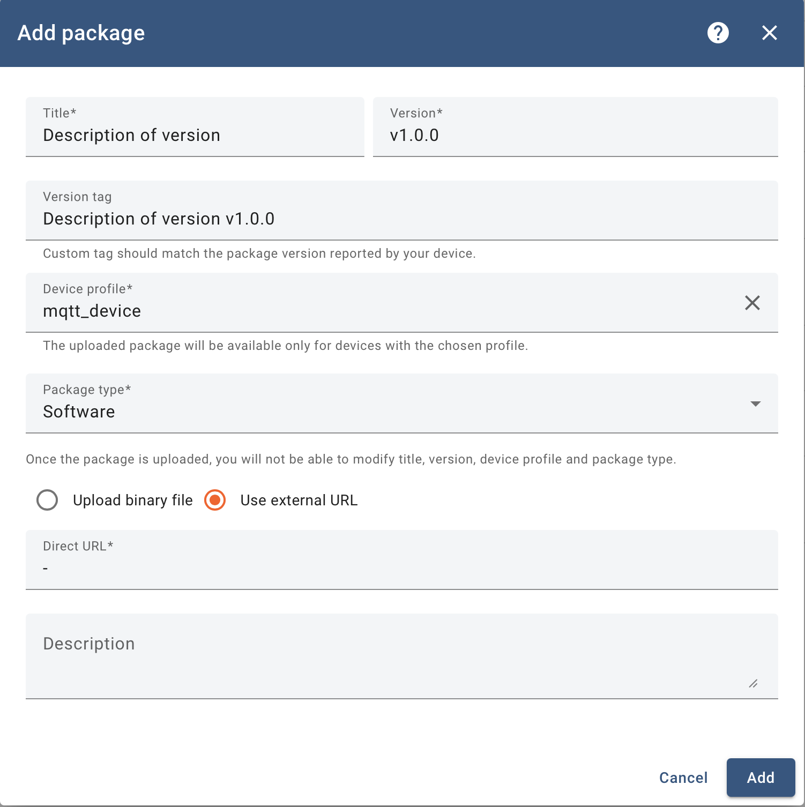
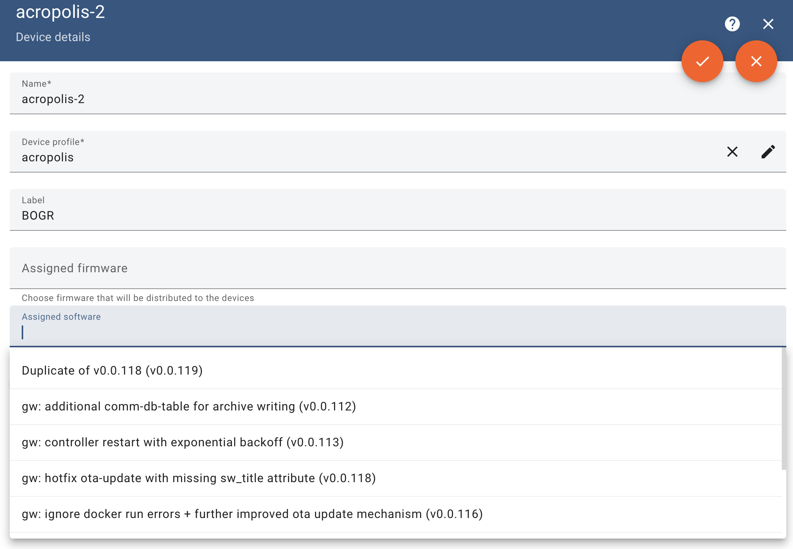

Remote Software Update
======================

The *Remote Software Update* feature allows you to deploy new versions of the Edge Gateway controller software to devices using ThingsBoard's OTA update mechanism. This enables the rollout of bug fixes, performance improvements, and new features without requiring physical access to deployed hardware.

OTA update packages reference version tags or commit hashes from the controller's GitHub repository. Once an OTA package is created and assigned to a device or device profile, Edge Gateway devices automatically receive the update, download the corresponding source code, build a Docker image locally if required, and deploy the new controller version.

The remote software update mechanism follows a *controller-only update model*. OTA updates apply exclusively to the Edge Gateway controller software and never update or restart the Edge Gateway runtime itself. This design ensures that connectivity, telemetry buffering, and management functions remain available throughout the update process.

Architecture Rationale
----------------------

A key design principle of the Edge Gateway is the strict separation between the gateway runtime and the controller software. This separation ensures that software updates to the controller do not affect the core Edge Gateway functionality.

Even if a newly deployed controller version contains errors or fails to start correctly, the Edge Gateway itself remains operational. It continues to report device status and update progress to ThingsBoard, allowing operators to monitor deployments and safely roll back to a previous, stable controller version when necessary.

This separation allows updates to be monitored and controlled remotely without risking loss of connectivity. Even in the case of repeated controller failures, the Edge Gateway can continue reporting status information and accept corrective actions such as rollbacks or configuration changes.

Create an OTA Update Package
----------------------------

To deploy a new controller version, an OTA update package must first be created in the ThingsBoard Web UI.

1. Navigate to **Advanced features → OTA Updates**.
2. Create a new OTA update entry.
3. Set the **Title** to identify the controller version.
4. Set **Version** to match the GitHub version tag or commit hash of the controller release (for example ``v1.0.0``).
5. Select the **Device Profiles** corresponding to the Edge Gateway devices.
6. Set **Package type** to *Software*.
7. Enable **Use external URL** and leave the URL field empty (``-``).

.. note::

   The **Version** field is treated as an opaque identifier by the Edge Gateway. It is not interpreted semantically and must match the version tag or commit hash used to retrieve the controller source code.

Assign the OTA Package to a Device
----------------------------------

After creating the OTA package, it must be assigned to the target device.

1. Navigate to **Entities → Devices**.
2. Select the target Edge Gateway device.
3. Open the **Details** tab and click **Edit**.
4. Under **Assigned Software**, select the previously created OTA package from the dropdown list.
5. Click **OK** to apply the changes.

Update Execution and Monitoring
-------------------------------

Once the OTA package is assigned, the Edge Gateway performs the update automatically:

- The currently running controller is stopped.
- The new controller version is downloaded.
- A Docker image is created locally if it does not already exist.
- The controller is restarted using the new version.

The update procedure is executed synchronously for each device. During the controller restart, incoming telemetry from the controller may be temporarily unavailable, but the Edge Gateway itself remains connected to ThingsBoard and continues reporting update status.

Throughout the process, the Edge Gateway reports its update state back to ThingsBoard using the standard OTA update attributes. The update progress and final status can be monitored via the ThingsBoard Update Dashboard using the ``sw_state`` attribute.

For additional details on OTA update states and workflows, refer to the official ThingsBoard documentation:
https://thingsboard.io/docs/user-guide/ota-updates/

Rolling Back to Previous Versions
---------------------------------

The remote software update mechanism also supports rolling back to earlier controller versions.

Rollback operations follow the same execution path as forward updates. No special rollback mode is required, and the previously selected version becomes the desired state once assigned via ThingsBoard.

To perform a rollback, assign an OTA package that references the desired previous version tag or commit hash to the device. The Edge Gateway will stop the currently running controller and restart it using the selected version.

If a Docker image for the requested version is already available locally, it is reused. Otherwise, the Edge Gateway automatically downloads the corresponding source code from GitHub and builds a new Docker image.

This approach enables rapid switching between controller versions and provides a reliable recovery path in case issues arise with newly deployed releases.

Operational Notes
-----------------

- OTA updates do not reboot the host system.
- OTA updates do not restart the Edge Gateway runtime process.
- Network interruptions during downloads are handled transparently and retried once connectivity is restored.
- For large fleets, staged rollouts using device profiles are recommended to reduce operational risk.
